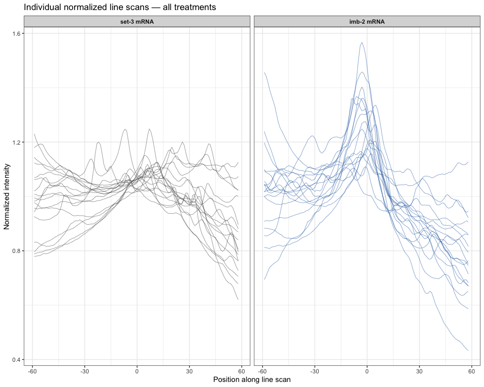
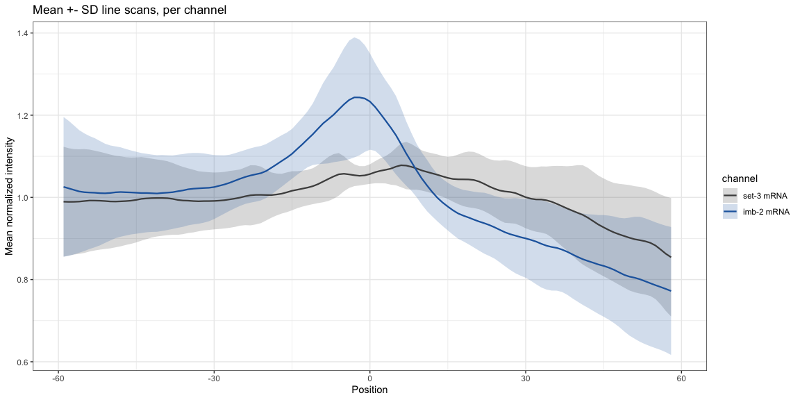
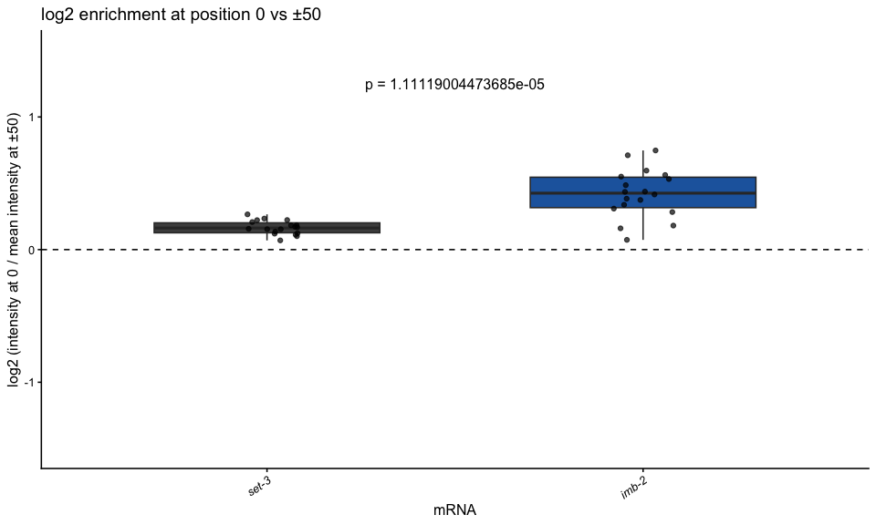

Nuclear membrane quantification of smFISH signal in C. elegans worms
================
Sam Zavislan-Pullaro and Erin Osborne Nishimura
2026-08-13

- [Step 1: libraries, import, and data
  munging](#step-1-libraries-import-and-data-munging)
  - [Load libraries](#load-libraries)
  - [Import data](#import-data)
  - [Create annotation columns and add
    timepoints](#create-annotation-columns-and-add-timepoints)
  - [Merge all data and apply fixed coordinate
    alignment](#merge-all-data-and-apply-fixed-coordinate-alignment)
- [Step 2: Normalize](#step-2-normalize)
  - [Color palettes](#color-palettes)
- [Step 3: Generate individual normalized line
  scans](#step-3-generate-individual-normalized-line-scans)
  - [Save the individual linescan
    plots](#save-the-individual-linescan-plots)
- [Step 4: Generate mean line scans](#step-4-generate-mean-line-scans)
  - [Save the mean line plots](#save-the-mean-line-plots)
- [Step 5: Calculate log2 fold change
  enrichment](#step-5-calculate-log2-fold-change-enrichment)
  - [Generate merged boxplot, x-axis by
    treatment](#generate-merged-boxplot-x-axis-by-treatment)
  - [Summary metrics](#summary-metrics)
  - [Statistics - Pairwise Wilcoxon](#statistics---pairwise-wilcoxon)
  - [Reps and N-values](#reps-and-n-values)
  - [Plot boxplot](#plot-boxplot)
  - [Save the box plots](#save-the-box-plots)
- [Step 6: Export plots and stats](#step-6-export-plots-and-stats)
- [Session info](#session-info)

# Step 1: libraries, import, and data munging

## Load libraries

- tidyverse
- data.table
- rstatix
- ggrepel
- gridExtra

``` r
library(tidyverse)
library(data.table)
library(rstatix)
library(ggrepel)
library(gridExtra)
```

------------------------------------------------------------------------

## Import data

Note: channel 1 = imb-2 mRNA \| channel 2 = set-3 mRNA

Strain: N2

``` r
# Load the data
# Only need to replace name of file. EX: ("../01_input/<NAME_OF_DATAFILE.txt>",header = FALSE, sep = "\t")

df_1 <- read.table("../01_input/2026-7-20_1510_datafile_for_250806_set3_imb2_rep1.txt",
                        header = FALSE, sep = "\t")
df_2 <- read.table("../01_input/2026-7-20_1518_datafile_for_250806_set3_imb2_rep2.txt",
                        header = FALSE, sep = "\t")
df_3 <- read.table("../01_input/2026-7-20_1525_datafile_for_250806_set3_imb2_rep3.txt",
                        header = FALSE, sep = "\t")
df_4 <- read.table("../01_input/2026-8-3_128_datafile_for_260527_N2_imb2_set3.txt",
                        header = FALSE, sep = "\t")
df_5 <- read.table("../01_input/2026-8-3_1212_datafile_for_260527_N2_imb2_set3.txt",
                        header = FALSE, sep = "\t")

# Check dimensions
# In this case, all data files should have vector length = 121. This is determined by the length of the ROI box in FIJI

#dim(df_1)
#dim(df_2)
#dim(df_3)
#dim(df_4)
#dim(df_5)

# The value 119 is actually determined by the dimensions, just subtract 2 from what you get in dimensions

col_times <- paste(rep(1:119), sep = "") 

# Set column names for the dataframes 

colnames(df_1) <- c("file", "channel", col_times)
colnames(df_2) <- c("file", "channel", col_times)
colnames(df_3) <- c("file", "channel", col_times)
colnames(df_4) <- c("file", "channel", col_times)
colnames(df_5) <- c("file", "channel", col_times)
```

------------------------------------------------------------------------

## Create annotation columns and add timepoints

Timepoints are treated as positions along line scan

``` r
# Helper function: pivot longer and annotate 
annotate_df <- function(df) {
  df[2:nrow(df), 1:121] %>% # 121 comes from dimensions
    separate_wider_delim(file, delim = "_",
                         names = c("date", "strain", "mRNA1", "mRNA2", "embryoID", NA)) %>%
    pivot_longer(cols = `1`:`119`, names_to = "xpoint", values_to = "intensity") %>%
    mutate(unique_id = paste(date, strain, mRNA1, mRNA2, embryoID, channel, sep = "_"))
}

# Helper function: add timepoints from the header row of any loaded table
addInTimepoints <- function(tibble, ref_table) {
  timepoints <- as.vector(unlist(ref_table[1, 3:121]))
  repnumb    <- nrow(tibble) / 119 
  tibble::add_column(tibble, timepoints = rep(timepoints, repnumb), .after = "xpoint")
}

# Add timepoints as proxy for pixel position along line scan 
df_1_pt <- addInTimepoints(annotate_df(df_1), df_1) # Use first dataframe as reference 
df_2_pt <- addInTimepoints(annotate_df(df_2), df_1)
df_3_pt <- addInTimepoints(annotate_df(df_3), df_1)
df_4_pt <- addInTimepoints(annotate_df(df_4), df_1)
df_5_pt <- addInTimepoints(annotate_df(df_5), df_1)

# Sanity check 
head(df_1_pt)
```

    ## # A tibble: 6 × 10
    ##   date   strain mRNA1 mRNA2 embryoID channel xpoint timepoints intensity
    ##   <chr>  <chr>  <chr> <chr> <chr>    <chr>   <chr>       <dbl>     <dbl>
    ## 1 250806 N2     imb2  set3  02       ch1     1           0        10217.
    ## 2 250806 N2     imb2  set3  02       ch1     2           0.107    10239.
    ## 3 250806 N2     imb2  set3  02       ch1     3           0.214    10240.
    ## 4 250806 N2     imb2  set3  02       ch1     4           0.322    10231.
    ## 5 250806 N2     imb2  set3  02       ch1     5           0.429    10241.
    ## 6 250806 N2     imb2  set3  02       ch1     6           0.536    10259.
    ## # ℹ 1 more variable: unique_id <chr>

------------------------------------------------------------------------

## Merge all data and apply fixed coordinate alignment

``` r
# Concatenate the dataframes 
all_data <- rbind(
  df_1_pt, df_2_pt, df_3_pt, df_4_pt, df_5_pt
)

center <- ceiling(119/2) # Using dims, find center point 
center
```

    ## [1] 60

``` r
dt <- as.data.table(all_data)
dt$xpoint <- as.integer(dt$xpoint)
dt[, aligned_row := xpoint - center]

total_align_long <- dt %>%
  select(strain, aligned_row, unique_id, intensity)

cat("Total rows:", nrow(total_align_long), "\n")
```

    ## Total rows: 4284

``` r
cat("Unique embryo IDs:", n_distinct(total_align_long$unique_id), "\n")
```

    ## Unique embryo IDs: 36

``` r
# head(total_align_long)
```

------------------------------------------------------------------------

# Step 2: Normalize

Each embryo is normalized to its own mean intensity (per embryo per
channel).

``` r
norm_total <- total_align_long %>%
  separate_wider_delim(unique_id, delim = "_",
                       names = c("date", NA, "mRNA1", "mRNA2", "embryoID", "channel")) %>%
  group_by(date, embryoID, channel, mRNA1, mRNA2) %>%
  mutate(normalized_intensity = intensity / mean(intensity, na.rm = TRUE)) %>%
  ungroup()

treatment_order <- c("ch2", "ch1")
norm_total$channel <- factor(norm_total$channel, levels = treatment_order)

# ch1 = imb-2, ch2 = set-3
norm_total <- norm_total %>%
  mutate(treatment_type = case_when(
    channel == "ch1" ~ "imb-2",
    channel == "ch2" ~ "set-3",
    TRUE ~ NA_character_
  ))

table(norm_total$channel, norm_total$treatment_type)
```

    ##      
    ##       imb-2 set-3
    ##   ch2     0  2142
    ##   ch1  2142     0

------------------------------------------------------------------------

## Color palettes

``` r
treatment_colors <- c(
  "ch1" = "#2166AC",   # imb-2 — dark blue
  "ch2" = "#4D4D4D"    # set-3 — dark gray
)
type_colors <- treatment_colors

channel_labels <- c("ch1" = "imb-2 mRNA", "ch2" = "set-3 mRNA")
```

------------------------------------------------------------------------

# Step 3: Generate individual normalized line scans

All embryo-level line scans, faceted by channel and treatment.

``` r
p_linescan_individual <- ggplot(norm_total,
       aes(x = aligned_row, y = normalized_intensity,
           group = interaction(date, embryoID),
           color = channel)) +
  geom_line(alpha = 0.6, linewidth = 0.3) +
  scale_color_manual(values = treatment_colors) +
  facet_wrap(~ channel, labeller = labeller(channel = channel_labels)) +
  labs(
    title = "Individual normalized line scans — all treatments",
    x     = "Position along line scan",
    y     = "Normalized intensity",
    color = "Treatment"
  ) +
  guides(color = "none") +
  theme_bw(base_size = 11) +
  theme(strip.text = element_text(face = "bold"))
p_linescan_individual
```

<!-- -->

------------------------------------------------------------------------

## Save the individual linescan plots

``` r
# Create an output directory
output_dir <- "../03_output"
dir.create(output_dir, showWarnings = FALSE, recursive = TRUE)

# Save a filename
today <- format(Sys.Date(), "%y%m%d")
filename <- paste(output_dir, "/", today, "_linescan_individual.pdf", sep = "")

# Save the plot
pdf(filename, width = 7, height = 6)
p_linescan_individual
dev.off()
```

    ## quartz_off_screen 
    ##                 2

# Step 4: Generate mean line scans

``` r
# Calculate the mean signal of all the linscan plots and calculate the standard deviation
mean_signal <- norm_total %>%
  group_by(aligned_row, channel) %>%
  summarize(
    mean_signal = mean(normalized_intensity, na.rm = TRUE),
    sd_signal   = sd(normalized_intensity,   na.rm = TRUE),
    .groups     = "drop"
  ) %>%
  mutate(
    ymeanmax = mean_signal + sd_signal,
    ymeanmin = mean_signal - sd_signal
  )

# Plot the means and sd as linescans and ribbons
p_linescan_mean <- ggplot(mean_signal,
       aes(x = aligned_row, y = mean_signal,
           group = channel)) +
  geom_ribbon(aes(ymin = ymeanmin, ymax = ymeanmax,
                  fill = channel), alpha = 0.2, color = NA) +
  geom_line(aes(color = channel), linewidth = 0.8) +
  scale_color_manual(values = treatment_colors, labels = channel_labels) +
  scale_fill_manual(values  = treatment_colors, labels = channel_labels) +
  labs(
    title = "Mean +- SD line scans, per channel",
    x     = "Position",
    y     = "Mean normalized intensity"
  ) +
  theme_bw(base_size = 11)

 p_linescan_mean
```

<!-- -->

------------------------------------------------------------------------

## Save the mean line plots

``` r
# Save a filename
today <- format(Sys.Date(), "%y%m%d")
filename <- paste(output_dir, "/", today, "_linescan_mean.pdf", sep = "")

# Save the plot
pdf(filename, width = 7, height = 6)
p_linescan_mean
dev.off()
```

    ## quartz_off_screen 
    ##                 2

------------------------------------------------------------------------

# Step 5: Calculate log2 fold change enrichment

Ratio of normalized intensity at position 1 versus the mean of positions
-50 and +50. Higher values indicate more enriched localization signal
(consistent with membrane localization).

``` r
peaks_and_valleys <- norm_total %>%
  filter(aligned_row %in% c(-50, 1, 50))

nest_pandv <- peaks_and_valleys %>%
  group_by(date, mRNA1, mRNA2, embryoID, channel) %>%
  nest()

my_calc2 <- function(df) {
  df$normalized_intensity[df$aligned_row == 1] /
    mean(df$normalized_intensity[df$aligned_row %in% c(-50, 50)])
}

foldChange_calc <- nest_pandv %>%
  mutate(fc_enrich = map_dbl(data, my_calc2)) %>%
  mutate(
    log2_fc        = log(fc_enrich, base = 2),
    treatment_type = case_when(
      channel == "ch1" ~ "imb-2",
      channel == "ch2" ~ "set-3",
      TRUE ~ NA_character_
    ),
    channel        = factor(channel, levels = treatment_order)
  )

summary(foldChange_calc$log2_fc)
```

    ##    Min. 1st Qu.  Median    Mean 3rd Qu.    Max. 
    ## 0.06952 0.15616 0.22259 0.29340 0.42068 0.74754

## Generate merged boxplot, x-axis by treatment

``` r
foldChange_calc <- foldChange_calc %>%
  mutate(treatment_type = factor(treatment_type, levels = c("set-3", "imb-2")))
```

------------------------------------------------------------------------

## Summary metrics

``` r
summary_stats_table <- foldChange_calc %>%
  group_by(treatment_type, channel) %>%
  summarise(
    n             = n(),
    min_log2fc    = round(min(log2_fc,    na.rm = TRUE), 3),
    median_log2fc = round(median(log2_fc, na.rm = TRUE), 3),
    mean_log2fc   = round(mean(log2_fc,   na.rm = TRUE), 3),
    max_log2fc    = round(max(log2_fc,    na.rm = TRUE), 3),
    .groups = "drop"
  ) %>%
  arrange(channel, treatment_type)

print(summary_stats_table, n = Inf)
```

    ## # A tibble: 2 × 7
    ##   treatment_type channel     n min_log2fc median_log2fc mean_log2fc max_log2fc
    ##   <fct>          <fct>   <int>      <dbl>         <dbl>       <dbl>      <dbl>
    ## 1 set-3          ch2        18      0.07          0.163       0.166      0.266
    ## 2 imb-2          ch1        18      0.073         0.426       0.421      0.748

------------------------------------------------------------------------

## Statistics - Pairwise Wilcoxon

``` r
# Wilcoxon test comparing set-3 vs imb-2 enrichment
pairwise_stats <- foldChange_calc %>%
  ungroup() %>%
  wilcox_test(log2_fc ~ treatment_type) %>%
  adjust_pvalue(method = "BH") %>%
  add_significance()

pairwise_stats
```

    ## # A tibble: 1 × 9
    ##   .y.     group1 group2    n1    n2 statistic         p     p.adj p.adj.signif
    ##   <chr>   <chr>  <chr>  <int> <int>     <dbl>     <dbl>     <dbl> <chr>       
    ## 1 log2_fc set-3  imb-2     18    18        33 0.0000111 0.0000111 ****

``` r
# pairwise_stats$p
```

------------------------------------------------------------------------

## Reps and N-values

How many replicates and samples are represented in the dataset?

``` r
# select the metadata
metadata <- norm_total %>% 
  select("strain", "date", "embryoID")

# pick only the unique ones
metadata <- unique(metadata)

dim(metadata)
```

    ## [1] 18  3

``` r
str(metadata)
```

    ## tibble [18 × 3] (S3: tbl_df/tbl/data.frame)
    ##  $ strain  : chr [1:18] "N2" "N2" "N2" "N2" ...
    ##  $ date    : chr [1:18] "250806" "250806" "250806" "250806" ...
    ##  $ embryoID: chr [1:18] "02" "06" "08" "09" ...

``` r
head(metadata)
```

    ## # A tibble: 6 × 3
    ##   strain date   embryoID
    ##   <chr>  <chr>  <chr>   
    ## 1 N2     250806 02      
    ## 2 N2     250806 06      
    ## 3 N2     250806 08      
    ## 4 N2     250806 09      
    ## 5 N2     250806 01      
    ## 6 N2     250806 04

``` r
# tabulate the number of n-values. Divide by 2 because both set-3 and erm-1 are both counted as a data point
rep_and_n <- table(metadata$date)
rep_and_n
```

    ## 
    ## 250806 250807 260527 
    ##      8      2      8

## Plot boxplot

``` r
p_merged <- ggplot(foldChange_calc,
                   aes(x = treatment_type,
                       y = log2_fc,
                       fill = treatment_type)) +
  geom_boxplot(outlier.shape = NA, width = 0.6) +
  geom_jitter(aes(color = treatment_type),
              position = position_jitterdodge(jitter.width = 0.25),
              size = 1.5, alpha = 0.7) +
  scale_fill_manual(
    values = c("imb-2" = "#2166AC", "set-3" = "#4D4D4D"),
    guide  = "none"
  ) +
  scale_color_manual(
    values = c("imb-2" = "black", "set-3" = "black"),
    guide  = "none"
  ) +
  geom_hline(yintercept = 0, linetype = "dashed", color = "black") +
  scale_y_continuous(limits = c(-1.5, 1.5)) +
  labs(
    title = "log2 enrichment at position 0 vs ±50",
    x     = "mRNA",
    y     = "log2 (intensity at 0 / mean intensity at ±50)",
    fill  = NULL
  ) +
  theme_classic(base_size = 12) +
  annotate("text", x = 1.5, y = 1.25, label = paste("p = ", pairwise_stats$p, sep = "")) +
  theme(
    axis.text.x     = element_text(angle = 35, hjust = 1, face = "italic"),
    strip.text      = element_text(face = "bold"),
    legend.position = "none"
  )

p_merged
```

<!-- -->

------------------------------------------------------------------------

## Save the box plots

``` r
# Save a filename
today <- format(Sys.Date(), "%y%m%d")
filename <- paste(output_dir, "/", today, "_boxplot_merged.pdf", sep = "")

# Save the plot
pdf(filename, width = 7, height = 6)
p_merged
dev.off()
```

    ## quartz_off_screen 
    ##                 2

------------------------------------------------------------------------

# Step 6: Export plots and stats

``` r
# Save some files as .csvs
write_csv(dt, file.path(output_dir,paste0(today, "_aligned_raw_data.csv")))
write_csv(summary_stats_table, file.path(output_dir, paste0(today, "_summary_stats.csv")))
write_csv(pairwise_stats, file.path(output_dir, paste0(today, "_pairwise_wilcoxon_stats.csv")))


# Save the rep and n nubmers
today <- format(Sys.Date(), "%y%m%d")
filename <- paste(output_dir, "/", today, "_rep_and_n.txt", sep = "")
write.table(rep_and_n, file = filename, sep = "\t", quote = FALSE, row.names = FALSE)
```

------------------------------------------------------------------------

# Session info

``` r
sessionInfo()
```

    ## R version 4.6.0 (2026-04-24)
    ## Platform: aarch64-apple-darwin23
    ## Running under: macOS Tahoe 26.5.2
    ## 
    ## Matrix products: default
    ## BLAS:   /Library/Frameworks/R.framework/Versions/4.6/Resources/lib/libRblas.0.dylib 
    ## LAPACK: /Library/Frameworks/R.framework/Versions/4.6/Resources/lib/libRlapack.dylib;  LAPACK version 3.12.1
    ## 
    ## locale:
    ## [1] en_US.UTF-8/en_US.UTF-8/en_US.UTF-8/C/en_US.UTF-8/en_US.UTF-8
    ## 
    ## time zone: America/Denver
    ## tzcode source: internal
    ## 
    ## attached base packages:
    ## [1] stats     graphics  grDevices utils     datasets  methods   base     
    ## 
    ## other attached packages:
    ##  [1] gridExtra_2.3.1   ggrepel_0.9.8     rstatix_1.1.0     data.table_1.18.4
    ##  [5] lubridate_1.9.5   forcats_1.0.1     stringr_1.6.0     dplyr_1.2.1      
    ##  [9] purrr_1.2.2       readr_2.2.0       tidyr_1.3.2       tibble_3.3.1     
    ## [13] ggplot2_4.0.3     tidyverse_2.0.0  
    ## 
    ## loaded via a namespace (and not attached):
    ##  [1] utf8_1.2.6         generics_0.1.4     stringi_1.8.9      hms_1.1.4         
    ##  [5] digest_0.6.39      magrittr_2.0.5     evaluate_1.0.5     grid_4.6.0        
    ##  [9] timechange_0.4.0   RColorBrewer_1.1-3 fastmap_1.2.0      backports_1.5.1   
    ## [13] Formula_1.2-6      scales_1.4.0       abind_1.4-8        cli_3.6.6         
    ## [17] crayon_1.5.3       rlang_1.3.0        bit64_4.8.2        withr_3.0.3       
    ## [21] yaml_2.3.12        otel_0.2.0         parallel_4.6.0     tools_4.6.0       
    ## [25] tzdb_0.5.0         broom_1.0.13       vctrs_0.7.3        R6_2.6.1          
    ## [29] lifecycle_1.0.5    bit_4.6.0          car_3.1-5          vroom_1.7.1       
    ## [33] pkgconfig_2.0.3    pillar_1.11.1      gtable_0.3.6       glue_1.8.1        
    ## [37] Rcpp_1.1.2         xfun_0.60          tidyselect_1.2.1   rstudioapi_0.19.0 
    ## [41] knitr_1.51         farver_2.1.2       htmltools_0.5.9    labeling_0.4.3    
    ## [45] rmarkdown_2.31     carData_3.0-6      compiler_4.6.0     S7_0.2.2
